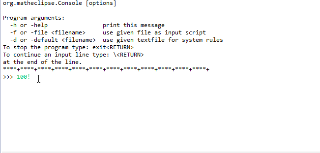

## Symja Library - Java Symbolic Math System

**Note**: this repository contains the **Java 8 project**. The **Android library project** can be found in the [SymjaAndroid repository](https://bitbucket.org/axelclk/symjaandroid).


- [Features](#features)
- [Online demo](#online-demo)
- [Quick start](#quick-start)
- [Examples](#examples)
- [Maven Usage](#maven-usage)
- [Getting started](#getting-started)
- [BitBucket GIT](#bitbucket-git)
- [Contact](#contact)
- [License](#license)

### Quick start 

Read the [Symja Manual](symja_android_library/doc/index.md) for the description of the Symja language.

### Features

Features of the Symja language:

* arbitrary precision integers, rational and complex numbers
* differentiation, integration, equation solving, polynomial and linear algebra functions...
* a general purpose [Term Rewriting System and Pattern Matching engine](symja_android_library/doc/functions-and-patterns.md)
* use human readable math expression strings or the internal abstract syntax tree (AST) representation to code in Java. See the [Unit test examples](symja_android_library/matheclipse-core/src/test/java/org/matheclipse/core/system/LowercaseTestCase.java)
   
### Online demo

* [Mobile web interface symjaweb.appspot.com](http://symjaweb.appspot.com/)  
* [Notebook interface symjaweb.appspot.com/new.jsp](http://symjaweb.appspot.com/new.jsp)

### Examples



```mma
>>> 24/60
2/5

>>> N(24/60)
0.4

>>> sin(30*degree)
1/2

>>> sin(pi/2)
1

>>> a+a+4*b^2+3*b^2
2*a+7*b^2

>>> solve({x^2-11==y, x+y==-9}, {x,y})
{{x->-2,y->-7},{x->1,y->-10}}

>>> dsolve({y'(x)==y(x)+2,y(0)==1},y(x), x)
{{y(x)->-2+3*E^x}}

>>> integrate(cos(x)^5, x)
-2/3*Sin(x)^3+Sin(x)^5/5+Sin(x)

>>> D(sin(x^3), x)
3*x^2*Cos(x^3)

>>> factor(-1+x^16)
(-1+x)*(1+x)*(1+x^2)*(1+x^4)*(1+x^8)

>>> factor(5+x^12, Modulus->7)
(2+x^3)*(4+x^6)*(5+x^3)

>>> expand((-1+x)*(1+x)*(1+x^2)*(1+x^4)*(1+x^8))
-1+x^16

>>> det({{1,2},{3,4}})
-2

>>> inverse({{1,2},{3,4}})
{{-2,1},
 {3/2,-1/2}}

>>> factorinteger(2^15-5)
{{3,1},{67,1},{163,1}}

>>> refine(abs(n*abs(m)), n<0)
-n*Abs(m)
```


### Maven Usage

Using Maven, add the following to your `pom.xml`

```xml
<dependencies>
  <dependency>
    <groupId>org.matheclipse</groupId>
      <artifactId>matheclipse-core</artifactId>
	  <version>1.0.0-SNAPSHOT</version>
    </dependency>
</dependencies>

<repositories> 
  <repository>
    <id>snapshots-repo</id>
    <url>https://oss.sonatype.org/content/repositories/snapshots</url>
    <releases>
      <enabled>false</enabled>
    </releases>
    <snapshots>
      <enabled>true</enabled>
    </snapshots>
  </repository>
  <repository>
    <id>jas-repository</id>
    <url>http://krum.rz.uni-mannheim.de/maven-repository</url>
  </repository>
  <repository>
    <id>Lab4Inf</id>
    <url>http://www.lab4inf.fh-muenster.de/lab4inf/maven-repository</url>
  </repository>
</repositories>
```

and run

```
mvn clean install
```

With the following command you can run the Symja console from the command line
```
mvn exec:java -pl matheclipse-core
``` 
 
With the following command you can run a symja console with a Mathematica-compatible syntax and functions
```
mvn exec:java@mma -pl matheclipse-core 
```

With the following command you can build a fat jar which contains all needed classes
```
mvn assembly:single -pl matheclipse-core
```

The *Excelsior JET Maven Plugin* provides Maven users with an easy way to compile their applications
down to optimized native Windows, OS X, or Linux executables with [Excelsior JET](http://excelsiorjet.com).
```
mvn jet:build -pl matheclipse-core
```

### Getting started

First, you'll need a Java Development Kit compatible with Java 8 or later.

You can find JDK installers at:

* http://www.oracle.com/technetwork/java/javase/downloads/jdk8-downloads-2133151.html

If you're unsure how to install the JDK, you can find instructions for
all operating systems here: 

* https://docs.oracle.com/javase/8/docs/technotes/guides/install/install_overview.html

Pay careful attention to anything about setting up your `PATH` or `CLASSPATH`.

Install and open the latest version of the Eclipse development IDE:

* http://www.eclipse.org/downloads/packages/eclipse-ide-java-developers/mars1

### BitBucket GIT

a) Fork the Symja repository to use as a starting point.

* Navigate to https://bitbucket.org/axelclk/symja_android_library/fork in your browser.
* Click the "Fork" button in the top-right of the page.
* Once your fork is ready, open the new repository's "Settings" by clicking the link in the menu bar on the left.
* Change the repository name to the name of your Library and save your changes.
  
b) Clone your new repository to your Eclipse workspace.

* Open Eclipse and select the File → Import... menu item.
* Select Git → Projects from Git, and click "Next >".
* Select "URI" and click "Next >". 
* Enter your repository's clone URL in the "URI" field. The remaining fields in the "Location" and "Connection" groups will get automatically filled in.
* Enter your BitBucket credentials in the "Authentication" group, and click "Next >".
* Select the `master` branch on the next screen, and click "Next >".
* The default settings on the "Local Configuration" screen should work fine, click "Next >".
* Make sure "Import existing projects" is selected, and click "Next >".
* Eclipse should find and select the `symja_android_library` automatically, click "Finish".
  

See also the "Getting started with Symja" document on the BitBucket Wiki pages:

* [Symja wiki pages](https://bitbucket.org/axelclk/symja_android_library/wiki)

### Contact

If you have any questions about using or developing for this project, shoot me
an [email][1]!

### License

* the complete Symja system is published under the GNU GENERAL PUBLIC LICENSE Version 3.

If you would like to use parts of the system here are the associated licenses:

* the [JAS Java Algebra System](http://krum.rz.uni-mannheim.de/jas/) is published under the (LESSER) GNU GENERAL PUBLIC LICENSE licence. The Java bytecode is dual licenced also under the Apache 2.0 licence to allow usage in Android projects. 
* the [Apache Commons Mathematics Library](http://commons.apache.org/math/) is published under the Apache software licence
* the [Hipparchus Mathematics Library](https://www.hipparchus.org/) is published under the Apache software licence
* the Symja parser libraries (org.matheclipse.parser* packages) are published under the APACHE LICENSE Version 2.0.

[1]: mailto:axelclk@gmail.com
[2]: http://www.vogella.com/tutorials/EclipseGit/article.html
